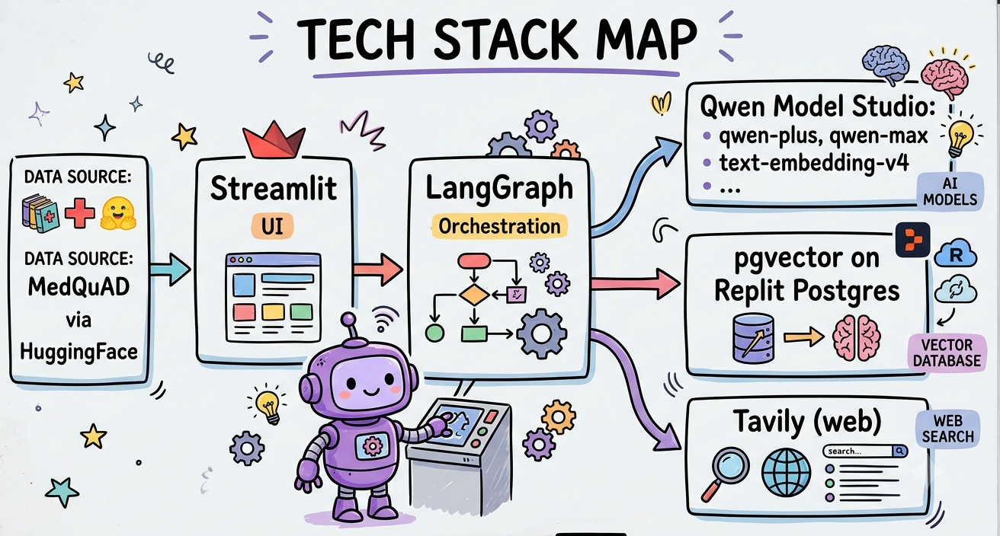
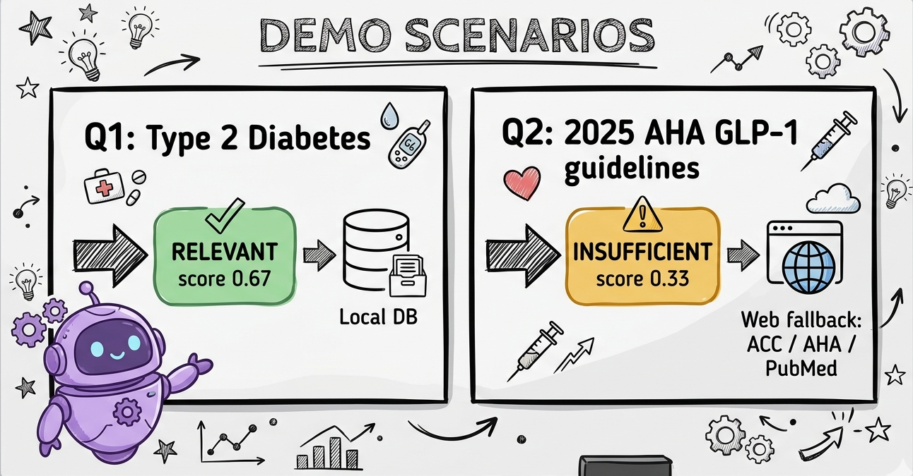
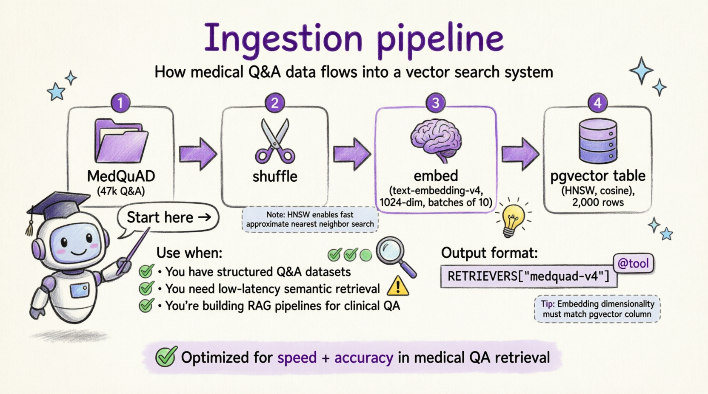
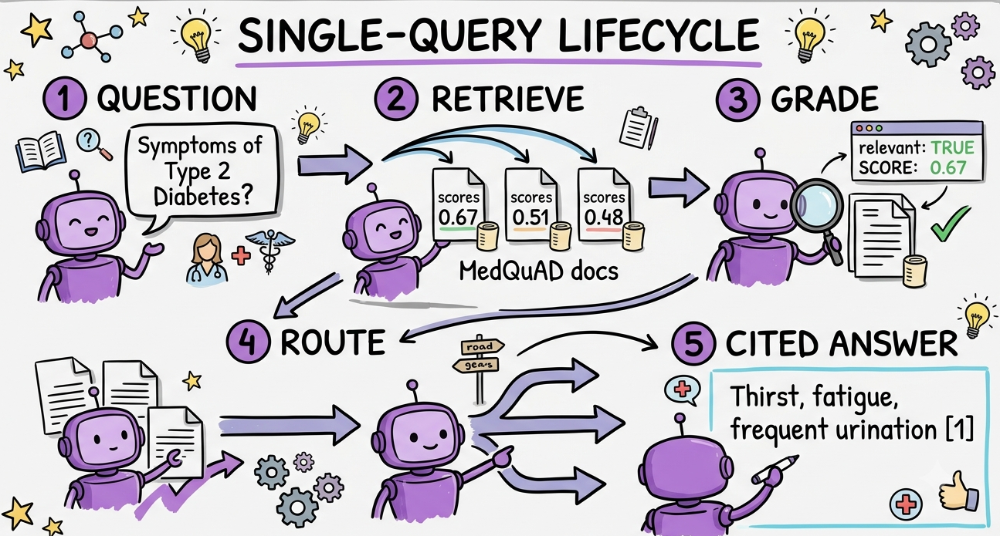
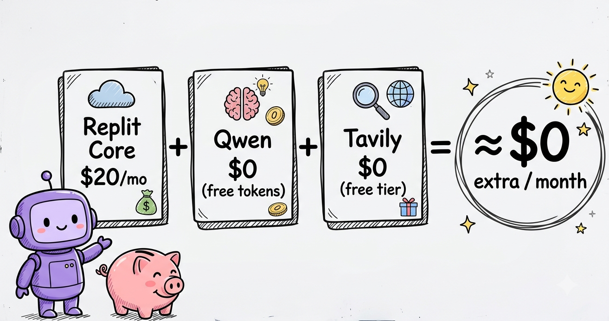
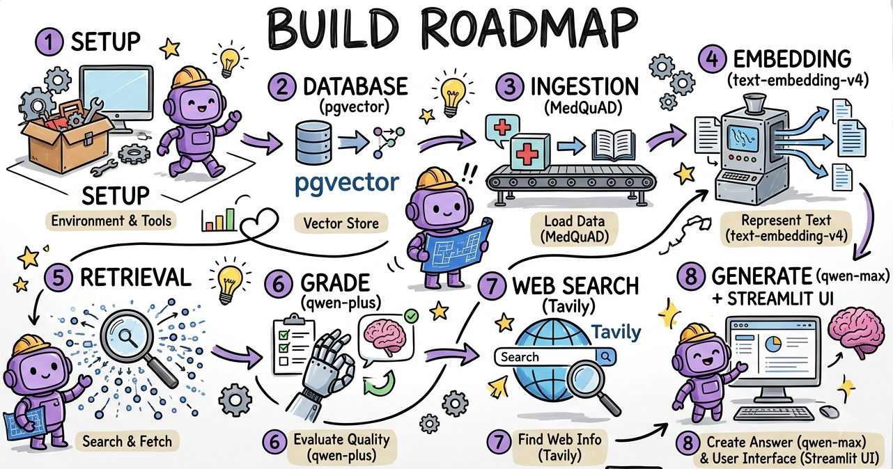

<div align="center">

# 🩺 Clinical Evidence Synthesizer

### Corrective RAG (CRAG) for medical questions — it grades its own retrieval and self-corrects to live sources

[](https://replit.com)
[](https://www.python.org)


<a href="https://replit.com/github/dglabsxyz/clinical-evidence-synthesizer"></a>

<sub>One-click import into Replit — then add your own <code>DASHSCOPE_API_KEY</code> and <code>TAVILY_API_KEY</code> in <b>Secrets</b> and press Run.</sub>


</div>

> **Why this matters:** in healthcare, a confident wrong answer is dangerous. This system doesn't blindly trust its database — a *grader* node inspects every retrieval and **self-corrects** by routing to authoritative live sources (CDC / WHO / PubMed / AHA) when the local evidence isn't good enough. Built with **LangGraph + Qwen (Model Studio) + pgvector + Tavily + Streamlit**, running entirely on **Replit**.

## Contents

- [What it does](#what-it-does-the-crag-loop)
- [How it behaves](#how-it-behaves-two-example-queries)
- [Diagrams](#diagrams)
- [Prerequisites](#prerequisites)
- [Run it from this repo](#run-it-from-this-repo)
- [Build it from scratch](#build-it-from-scratch)
- [Troubleshooting](#troubleshooting-every-issue-hit-during-this-build)
- [Cost](#cost)
- [Source code](#source-code)

---

## What it does (the CRAG loop)

```
          ┌─────────────┐
  question│  retrieve   │  top-3 from pgvector (Qwen embeddings, cosine)
─────────▶│   (pgvector)│
          └──────┬──────┘
                 ▼
          ┌─────────────┐   qwen-plus acts as a strict medical reviewer
          │    grade    │── "Is this evidence RELEVANT + SUFFICIENT?"
          └──────┬──────┘
            relevant?
        yes  ┌────┴────┐  no / insufficient
             ▼         ▼
      ┌──────────┐  ┌──────────────┐  Tavily, restricted to
      │ generate │  │  web_search  │  cdc.gov / who.int / pubmed / aha
      │(local DB)│  └──────┬───────┘
      └────┬─────┘         ▼
           │         ┌──────────┐
           └────────▶│ generate │  qwen-max synthesizes + cites [1],[2]
                     │  (+cites) │
                     └──────────┘
```

| Layer | Choice | Why |
|---|---|---|
| Orchestration | **LangGraph** state machine | The reviewable self-correction graph |
| Generation + Grader | **Qwen** `qwen-plus` (grade) / `qwen-max` (generate) via Model Studio | OpenAI-compatible API |
| Embeddings | **Qwen `text-embedding-v4`** (1024-dim) | Frontier multilingual retrieval, no local model/RAM |
| Vector store | **Replit Postgres + pgvector** (HNSW index) | Native, persistent, survives restarts |
| Web fallback | **Tavily** (free tier) | Agent-grade search, scoped to authoritative medical domains |
| Knowledge base | **MedQuAD** (`lavita/MedQuAD`, 47k Q&A) | Authoritative NIH / NIDDK / GHR medical Q&A |
| UI | **Streamlit** | Visualizes the routing |

---

## How it behaves (two example queries)

**Q1 — "What are the symptoms of Type 2 Diabetes?" → stays LOCAL.**
The grader finds the retrieved MedQuAD evidence relevant (top score ~0.67) and
answers from the local DB with a citation.
> ✅ *Grader verdict: local evidence **RELEVANT** → answered from the Local DB (MedQuAD)*

**Q2 — "What are the latest 2025 AHA guidelines for GLP-1 agonists in heart failure?" → WEB FALLBACK.**
The local hits are off-topic (rare-disease Q&As, scores ~0.33), so the grader flags
them **INSUFFICIENT** and routes to Tavily, which returns current 2025 cardiology
sources (ACC, AHA Journals, PubMed, JACC).
> ⚠️ *Grader verdict: local evidence **INSUFFICIENT** → routed to Web fallback (CDC / WHO / PubMed via Tavily)*

---

## Diagrams

> The architecture diagram is shown at the top of this page.

**Naive RAG vs Corrective RAG**


**Tech stack**


**Demo scenarios**


**Ingestion pipeline**


**Single-query lifecycle**


**Cost**


**Build roadmap**


**Semantic search**


---

## Prerequisites

1. **Replit Core** account (the managed Postgres + pgvector is billed through Core).
2. A **Model Studio (DashScope) API key** — Alibaba Cloud Model Studio, **International
   (Singapore)** region in this build. https://modelstudio.console.alibabacloud.com
3. A **Tavily API key** — free tier, 1,000 searches/mo, no credit card. https://app.tavily.com

No HuggingFace token needed — MedQuAD is a public dataset.

---

## Run it from this repo

1. **Import this repo into Replit:** Create → Import code → paste the repo URL.
2. **Add Secrets** (Tools → Secrets): `DASHSCOPE_API_KEY`, `TAVILY_API_KEY`.
3. **Provision Postgres:** Tools → Database (creates `DATABASE_URL` automatically).
4. In the **Shell**: `pip install -r requirements.txt`
5. Ingest: `python ingest.py 2000`
6. Run: `streamlit run app.py --server.address 0.0.0.0 --server.port 5000 --server.headless true --server.enableCORS false --server.enableXsrfProtection false`
7. Open the **port-5000 URL** (Tools → Networking shows it).

---

## Build it from scratch

### 1. Create the project
On the Replit home, type into the Agent box *"A Python app called
clinical-evidence-synthesizer"* and submit (↑). Replit opens the Workspace.

> ℹ️ Replit's Agent scaffolds a **Node/pnpm** starter even for a "Python" request.
> Harmless — we add Python next and ignore the Node files.

### 2. Open the Shell and enable Python
Open **Tools & files → Shell**. Run `python3 --version`. When prompted
**"Install Replit's Python tools [y/n]"**, type **`y`** (installs Python 3.11).

### 3. Create the files
In the Shell, scaffold all the files at once:
```bash
mkdir -p .streamlit && touch embeddings.py db.py ingest.py graph.py app.py requirements.txt .streamlit/config.toml
```
Open the **Files** panel, click each file, and paste its contents from the
[Source code](#source-code) section below.

### 4. Install dependencies
```bash
pip install -r requirements.txt
```

### 5. Provision the database
**Tools → Database.** This exposes `DATABASE_URL` to your app automatically.
pgvector is enabled by the app on first connect (`CREATE EXTENSION IF NOT EXISTS vector`).

### 6. Add your API keys as Secrets
**Tools → Secrets → New Secret.** Add exactly `DASHSCOPE_API_KEY` and `TAVILY_API_KEY`
(names must match, all caps).

> ⚠️ **Gotcha:** secrets added *after* a Shell is open are **not** visible in that
> shell. **Open a new Shell tab.** Verify (without printing values):
> ```bash
> for k in DASHSCOPE_API_KEY TAVILY_API_KEY DATABASE_URL; do
>   [ -n "${!k}" ] && echo "$k SET" || echo "$k MISSING"; done
> ```

### 7. Ingest the knowledge base
```bash
python ingest.py 2000
```
Loads MedQuAD, shuffles it, embeds 2,000 Q&A pairs, and stores them in pgvector.
**Expected:** `Inserted 2000 rows. Total now: 2000`. (A HF *"sending unauthenticated
requests"* warning is harmless.)

### 8. Run the app
```bash
streamlit run app.py --server.address 0.0.0.0 --server.port 5000 \
  --server.headless true --server.enableCORS false --server.enableXsrfProtection false
```
Open the app at the **port-5000 dev URL** (Tools → Networking → the `:5000` row).

> ⚠️ **Gotcha:** the clean dev-domain root is occupied by Replit's built-in preview
> server, so use the explicit **`:5000`** URL for the Streamlit app.

---

## Troubleshooting (every issue hit during this build)

| Symptom | Cause | Fix |
|---|---|---|
| `operator does not exist: vector <=> double precision[]` | Query embedding sent as a Postgres array, not a `vector` | Format as `"[v1,v2,...]"` and cast `%s::vector` (already done in `db.py`) |
| Secrets read as `MISSING` in the shell | Shell started before the secret was added | Open a **new** Shell tab |
| Baseline question routes to web (no local hit) | MedQuAD is ordered by source; first rows are rare genetic conditions | **Shuffle** before `.select()` (already done in `ingest.py`) |
| App not at the clean `.replit.dev` root | Replit's built-in preview server owns external port 80 | Use the **`:5000`** URL (Tools → Networking) |
| `Install Replit's Python tools [y/n]` | Repl scaffolded as Node | Type **`y`** |
| HF warning: *"sending unauthenticated requests"* | No HF token | Harmless for public MedQuAD; ignore (or add `HF_TOKEN`) |
| Embedding dim mismatch errors | `text-embedding-v4` dim ≠ pgvector column | Keep both at **1024** (default); re-embed if you change it |
| Embeddings request rejected (too many inputs) | DashScope caps embeddings at **10 texts/request** | Batch at 10 (already done in `embeddings.py`) |

**Tested library versions** (pin in `requirements.txt` if a future release breaks
something): `streamlit==1.58.0`, `openai==2.41.1`, `pgvector==0.4.2`,
`psycopg[binary]==3.3.4`, `tavily-python==0.7.26`, `datasets==5.0.0`, plus `langgraph`.

---

## Alternative: scaffold with the Replit Agent

Instead of creating the files by hand, you can have the Replit Agent build the app
(Plan mode ON), then add Secrets and run ingest:

> Build a Streamlit "Clinical Evidence Synthesizer" using LangGraph for a Corrective
> RAG (CRAG) flow. Use Replit Postgres + pgvector (1024-dim, HNSW, cosine). Use
> Alibaba Model Studio (DashScope) via its OpenAI-compatible endpoint
> `https://dashscope-intl.aliyuncs.com/compatible-mode/v1` with the
> `DASHSCOPE_API_KEY` secret: `qwen-plus` for a strict relevance grader, `qwen-max`
> for synthesis, `text-embedding-v4` for embeddings (batch ≤10). Graph: retrieve
> (top-3 cosine from pgvector) → grade (binary relevant/insufficient JSON) →
> conditional route → web_search (Tavily with `TAVILY_API_KEY`, restricted to
> cdc.gov/who.int/ncbi.nlm.nih.gov/pubmed/ahajournals.org) → generate (cite sources).
> Ingest a shuffled 2,000-row subset of the HuggingFace dataset `lavita/MedQuAD`
> (columns question/answer/document_url). The Streamlit UI must show the grader
> verdict, a "Local DB" vs "Web fallback" badge, the answer with citations, and the
> retrieved evidence with similarity scores.

---

## Cost

| Item | Cost |
|---|---|
| Replit Core | $20/mo (workspace + pgvector + $20 credits) |
| Qwen generation + embeddings (Model Studio) | $0 — free tokens |
| Tavily | $0 — free tier (1,000/mo) |
| **Net extra** | **~$0** |

---

## Source code

All files are in this repo. Shown here for the from-scratch build.

<details><summary><strong>requirements.txt</strong></summary>

```
langgraph
openai
tavily-python
psycopg[binary]
pgvector
datasets
streamlit
```
</details>

<details><summary><strong>embeddings.py</strong> — Qwen text-embedding-v4 via Model Studio</summary>

```python
"""Qwen text-embedding-v4 via Alibaba Model Studio (DashScope) OpenAI-compatible API."""
import os
from openai import OpenAI

# International (Singapore) endpoint. Change region here if your account differs.
BASE_URL = os.environ.get(
    "DASHSCOPE_BASE_URL",
    "https://dashscope-intl.aliyuncs.com/compatible-mode/v1",
)
EMBED_MODEL = "text-embedding-v4"
EMBED_DIM = 1024            # must match the pgvector column dimension
BATCH = 10                 # DashScope hard limit: <=10 texts per embeddings request

_client = None
def client():
    global _client
    if _client is None:
        _client = OpenAI(api_key=os.environ["DASHSCOPE_API_KEY"], base_url=BASE_URL)
    return _client

def embed_texts(texts):
    """Embed a list of strings, batching at 10. Returns list[list[float]]."""
    out = []
    for i in range(0, len(texts), BATCH):
        batch = texts[i:i + BATCH]
        resp = client().embeddings.create(
            model=EMBED_MODEL, input=batch, dimensions=EMBED_DIM
        )
        out.extend([d.embedding for d in resp.data])
    return out

def embed_query(text):
    return embed_texts([text])[0]
```
</details>

<details><summary><strong>db.py</strong> — Postgres + pgvector (note the ::vector cast)</summary>

```python
"""Postgres + pgvector helpers (Replit-managed Postgres)."""
import os
import psycopg
from pgvector.psycopg import register_vector

EMBED_DIM = 1024

def _url():
    url = os.environ["DATABASE_URL"]
    if "sslmode=" not in url:
        url += ("&" if "?" in url else "?") + "sslmode=require"
    return url

def get_conn():
    conn = psycopg.connect(_url(), autocommit=True)
    conn.execute("CREATE EXTENSION IF NOT EXISTS vector")
    register_vector(conn)
    return conn

def init_schema(conn):
    conn.execute(f"""
        CREATE TABLE IF NOT EXISTS evidence (
            id        BIGSERIAL PRIMARY KEY,
            source    TEXT,
            question  TEXT,
            answer    TEXT,
            embedding vector({EMBED_DIM})
        )
    """)
    conn.execute("""
        CREATE INDEX IF NOT EXISTS evidence_embedding_idx
        ON evidence USING hnsw (embedding vector_cosine_ops)
    """)

def count_rows(conn):
    return conn.execute("SELECT COUNT(*) FROM evidence").fetchone()[0]

def upsert_rows(conn, rows):
    """rows: list of (source, question, answer, embedding)."""
    with conn.cursor() as cur:
        cur.executemany(
            "INSERT INTO evidence (source, question, answer, embedding) "
            "VALUES (%s, %s, %s, %s)",
            rows,
        )

def search(conn, query_embedding, k=3):
    """Cosine-nearest k rows. Returns (question, answer, source, score)."""
    vec = "[" + ",".join(str(x) for x in query_embedding) + "]"
    return conn.execute(
        "SELECT question, answer, source, 1 - (embedding <=> %s::vector) AS score "
        "FROM evidence ORDER BY embedding <=> %s::vector LIMIT %s",
        (vec, vec, k),
    ).fetchall()
```
</details>

<details><summary><strong>ingest.py</strong> — MedQuAD → embeddings → pgvector (shuffled)</summary>

```python
"""Load a MedQuAD subset from HuggingFace, embed with Qwen, store in pgvector.

Usage:  python ingest.py [N]      # N = number of Q&A pairs (default 500)
"""
import sys
from datasets import load_dataset
import db
import embeddings

def pick(cols, *cands):
    low = {c.lower(): c for c in cols}
    for c in cands:
        if c in low:
            return low[c]
    return None

def main():
    n = int(sys.argv[1]) if len(sys.argv) > 1 else 500

    conn = db.get_conn()
    db.init_schema(conn)
    print("Existing rows:", db.count_rows(conn))

    print("Loading MedQuAD (lavita/MedQuAD) from HuggingFace...")
    ds = load_dataset("lavita/MedQuAD", split="train")
    cols = ds.column_names
    qcol = pick(cols, "question")
    acol = pick(cols, "answer")
    scol = pick(cols, "document_url", "url", "document_source", "source")
    print("Detected columns -> question:", qcol, "answer:", acol, "source:", scol)

    ds = ds.filter(lambda r: r.get(qcol) and r.get(acol))
    ds = ds.shuffle(seed=42).select(range(min(n, len(ds))))

    questions = [r[qcol] for r in ds]
    answers = [r[acol] for r in ds]
    sources = [(r.get(scol) if scol else None) or "MedQuAD" for r in ds]

    print(f"Embedding {len(questions)} Q&A pairs via {embeddings.EMBED_MODEL}...")
    texts = [f"{q}\n{a}" for q, a in zip(questions, answers)]
    vectors = embeddings.embed_texts(texts)

    rows = list(zip(sources, questions, answers, vectors))
    db.upsert_rows(conn, rows)
    print("Inserted", len(rows), "rows. Total now:", db.count_rows(conn))

if __name__ == "__main__":
    main()
```
</details>

<details><summary><strong>graph.py</strong> — the LangGraph CRAG state machine</summary>

```python
"""CRAG (Corrective RAG) state machine with LangGraph.

retrieve -> grade -> (relevant?) -> generate
                         |no
                         v
                     web_search -> generate
"""
import os
import json
from typing import TypedDict, List
from langgraph.graph import StateGraph, END
from openai import OpenAI
from tavily import TavilyClient
import db
import embeddings

BASE_URL = os.environ.get(
    "DASHSCOPE_BASE_URL",
    "https://dashscope-intl.aliyuncs.com/compatible-mode/v1",
)
GRADER_MODEL = "qwen-plus"   # cheap/fast: graded on every retrieval
GEN_MODEL = "qwen-max"       # top quality: final synthesis

_llm = None
def llm():
    global _llm
    if _llm is None:
        _llm = OpenAI(api_key=os.environ["DASHSCOPE_API_KEY"], base_url=BASE_URL)
    return _llm

def tavily():
    return TavilyClient(api_key=os.environ["TAVILY_API_KEY"])

class State(TypedDict, total=False):
    question: str
    documents: List[dict]
    relevant: bool
    route: str
    web_results: List[dict]
    answer: str

# ---- nodes ----------------------------------------------------------------
def retrieve_node(state):
    conn = db.get_conn()
    qvec = embeddings.embed_query(state["question"])
    rows = db.search(conn, qvec, k=3)
    docs = [{"question": r[0], "answer": r[1], "source": r[2], "score": float(r[3])}
            for r in rows]
    return {"documents": docs}

def grade_node(state):
    docs = state.get("documents", [])
    context = "\n\n".join(
        f"[Doc {i+1}] Q: {d['question']}\nA: {d['answer']}" for i, d in enumerate(docs)
    )
    prompt = (
        "You are a strict medical evidence reviewer. Decide whether the retrieved "
        "documents contain RELEVANT and SUFFICIENT, current clinical evidence to "
        "answer the question accurately. If the question asks for the latest/most "
        "recent guidelines and the documents are generic or undated, treat them as "
        'INSUFFICIENT. Respond with JSON only: {"relevant": true} or '
        '{"relevant": false}.\n\n'
        f"Question: {state['question']}\n\nDocuments:\n{context or '(none)'}"
    )
    resp = llm().chat.completions.create(
        model=GRADER_MODEL,
        messages=[{"role": "user", "content": prompt}],
        temperature=0,
    )
    relevant = _parse_relevant(resp.choices[0].message.content or "")
    return {"relevant": relevant, "route": "generate" if relevant else "web_search"}

def _parse_relevant(text):
    t = text.strip().lower()
    try:
        s, e = t.find("{"), t.rfind("}")
        if s != -1 and e != -1:
            return bool(json.loads(t[s:e + 1]).get("relevant"))
    except Exception:
        pass
    return ("true" in t) and ("false" not in t)

def web_search_node(state):
    res = tavily().search(
        query=state["question"],
        max_results=4,
        search_depth="advanced",
        include_domains=["cdc.gov", "who.int", "ncbi.nlm.nih.gov",
                         "pubmed.ncbi.nlm.nih.gov", "ahajournals.org", "nih.gov"],
    )
    web = [{"title": r.get("title", ""), "content": r.get("content", ""),
            "url": r.get("url", "")} for r in res.get("results", [])]
    return {"web_results": web}

def generate_node(state):
    if state.get("relevant"):
        ctx = "\n\n".join(
            f"[{i+1}] ({d['source']}) Q: {d['question']}\nA: {d['answer']}"
            for i, d in enumerate(state.get("documents", []))
        )
        src_label = "the local clinical knowledge base (MedQuAD)"
    else:
        ctx = "\n\n".join(
            f"[{i+1}] {w['url']}\n{w['content']}"
            for i, w in enumerate(state.get("web_results", []))
        )
        src_label = "live web sources (CDC / WHO / PubMed)"
    prompt = (
        "You are a clinical evidence synthesizer. Answer using ONLY the provided "
        "context. Be accurate and concise. Use inline citations like [1], [2] and "
        "list the sources at the end. If the context is insufficient, say so "
        "explicitly rather than guessing.\n\n"
        f"Question: {state['question']}\n\nContext from {src_label}:\n{ctx or '(none)'}"
    )
    resp = llm().chat.completions.create(
        model=GEN_MODEL,
        messages=[{"role": "user", "content": prompt}],
        temperature=0.2,
    )
    return {"answer": (resp.choices[0].message.content or "").strip()}

def _route(state):
    return state["route"]

def build_graph():
    g = StateGraph(State)
    g.add_node("retrieve", retrieve_node)
    g.add_node("grade", grade_node)
    g.add_node("web_search", web_search_node)
    g.add_node("generate", generate_node)
    g.set_entry_point("retrieve")
    g.add_edge("retrieve", "grade")
    g.add_conditional_edges("grade", _route,
                            {"generate": "generate", "web_search": "web_search"})
    g.add_edge("web_search", "generate")
    g.add_edge("generate", END)
    return g.compile()
```
</details>

<details><summary><strong>app.py</strong> — Streamlit UI that visualizes the routing</summary>

```python
"""Streamlit UI that visualizes the CRAG routing live."""
import streamlit as st
import graph as cg

st.set_page_config(page_title="Clinical Evidence Synthesizer",
                   page_icon="\U0001FA7A", layout="wide")

st.title("\U0001FA7A Clinical Evidence Synthesizer")
st.caption("Corrective RAG (CRAG) · Qwen + pgvector + Tavily — retrieves, "
           "self-grades its evidence, and falls back to live web sources when local "
           "evidence is insufficient.")

if "app" not in st.session_state:
    st.session_state.app = cg.build_graph()

examples = {
    "Baseline (stays local)": "What are the symptoms of Type 2 Diabetes?",
    "Time-sensitive (forces web fallback)":
        "What are the latest 2025 AHA guidelines for GLP-1 agonists in heart "
        "failure patients?",
}
c1, c2 = st.columns(2)
if c1.button(list(examples)[0]):
    st.session_state.q = examples[list(examples)[0]]
if c2.button(list(examples)[1]):
    st.session_state.q = examples[list(examples)[1]]

q = st.text_input("Ask a clinical question:",
                  value=st.session_state.get("q", ""),
                  placeholder="e.g., What are the symptoms of Type 2 Diabetes?")

if st.button("Synthesize", type="primary") and q:
    with st.spinner("retrieve → grade → route → generate ..."):
        result = st.session_state.app.invoke({"question": q})

    if result.get("relevant"):
        st.success("✅ Grader verdict: local evidence **RELEVANT** → "
                   "answered from the **Local DB (MedQuAD)**")
    else:
        st.warning("⚠️ Grader verdict: local evidence **INSUFFICIENT** → "
                   "routed to **Web fallback (CDC / WHO / PubMed via Tavily)**")

    left, right = st.columns([3, 2])
    with left:
        st.subheader("Synthesized answer")
        st.markdown(result.get("answer", "_no answer_"))
    with right:
        st.subheader("Retrieved local evidence")
        for d in result.get("documents", []):
            st.markdown(f"**{d['question']}**  \n"
                        f"score `{d['score']:.3f}` · _{d['source']}_  \n"
                        f"{d['answer'][:240]}…")
        if not result.get("relevant"):
            st.subheader("Live web sources used")
            for w in result.get("web_results", []):
                st.markdown(f"• [{w['title']}]({w['url']})")
```
</details>

<details><summary><strong>.streamlit/config.toml</strong></summary>

```toml
[server]
address = "0.0.0.0"
port = 5000
headless = true
enableCORS = false
enableXsrfProtection = false
```
</details>

---

## Notes & possible extensions

- **Grader depth:** the original CRAG paper grades *each* document and adds an
  *ambiguous* tier + a query-rewrite step before falling back.
- **Embeddings:** Qwen3-Embedding (`text-embedding-v4`) topped the MTEB multilingual
  leaderboard — strong retrieval and multilingual, with no local model or GPU.
- **Safety:** the generator is told to say "insufficient" rather than guess — in
  medicine, *not* hallucinating a fake guideline is the correct behavior.
